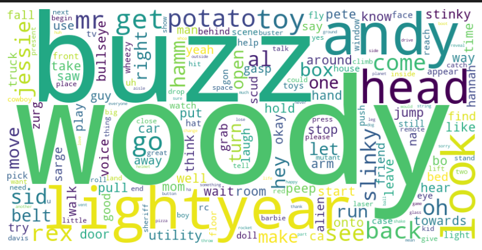
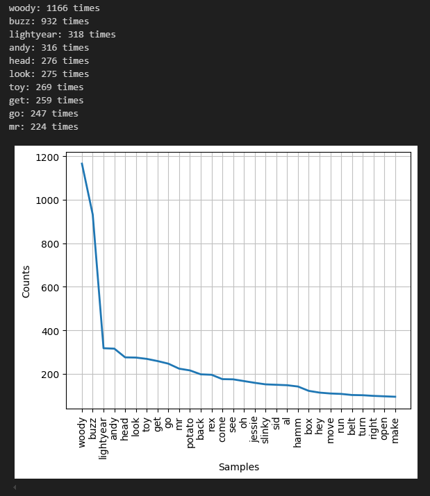
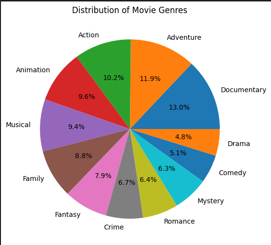
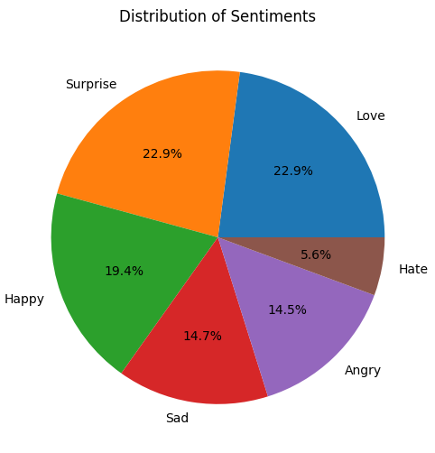
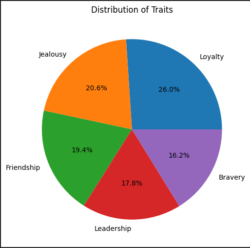

# NLP Analysis
Through a corpus extraction we chose to analyze toy story 1 and toy story 2 script and find interesting patterns using NLP.

* Corpus Creation: We first read CSV files that contain toy story script as text.
* Word Tokenization: We create tokens out of the raw text from the files.
* Sentence Tokenization: Splits text into individual sentences.
* Pos Tagging: POS tagging involves labeling each word in a text with its corresponding part of speech, such as Nouns, Verbs, Adjectives, Pronouns, Prepositions, Conjunctions, etc.
* Lemmatization: Lemmatization is the process of reducing a word to its base form (lemma), considering its context and part of speech (POS).

## Analysis Overview
### Word Frequency 
We visualize which are the most used words in both movies:
 
 

## Collocations
* Bigrams: We identified common word pairs that often appear together.
* Trigrams: Similarly, we identified common three word phrases.

## Embeddings
* Word2Vec: We use it to learn vector representations of the words.

## Clustering
* Latent Dirichlet Allocation (LDA): It is a model that identifies underlying topics in a text. It operates under the assumption that a given text is composed of a mixture of various topics.

## Zero shot model
*  Facebook/Bart-large-mnli: This is a zero shot classification model used to predict labels without task-specific training.

## Movie Genre Classification
 

## Sentiment Distribution
 

## Trait Distribution
 